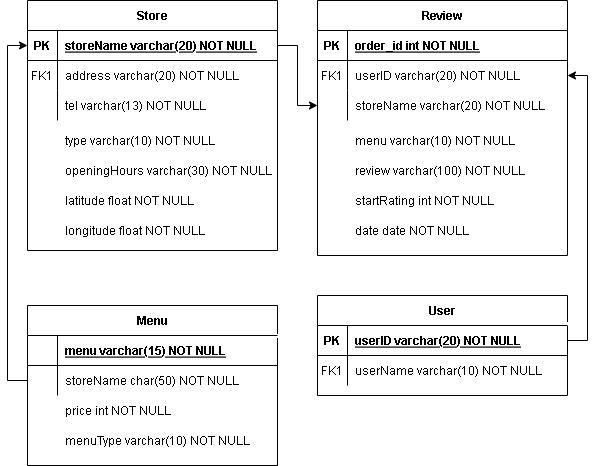

# html,php-stud

### cwnu-dinner프로젝트 (2021.02 ~ 1개월)

'오늘 저녁은 뭐먹지?'라는 고민에서 시작된    
'학교 앞 식당들은 뭐가있는지 보여주고, 리뷰를 남길 수 있는 어플을 만들자!'    
라는 아이디어로 시작된 *cwnu-dinner* 프로젝트.    

------
 

맡은 역할 : 백엔드
- DB설계 및 구축
- 웹서버 구축
- DB CRUD 작성

 

|개발 환경 | |
|:---:|:---|
|서버|AWS EC2, apach|
|DB|mysql|
|개발언어|PHP|

---
### DB 설계
개발 당시 작업한 파일이 사라져서 개발 내용을 토대로 간략하게 ER다이어그램을 작성하였다.

